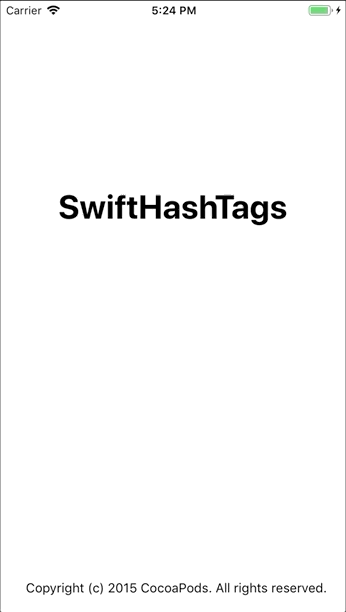

# SwiftHashTags

[](https://travis-ci.org/hcasc/SwiftHashTags)
[](https://cocoapods.org/pods/SwiftHashTags)
[](https://cocoapods.org/pods/SwiftHashTags)
[](https://cocoapods.org/pods/SwiftHashTags)

## Example

To run the example project, clone the repo, and run `pod install` from the Example directory first.

## Demo


## Requirements
```ruby
iOS 9.0 or later
```

## Installation

SwiftHashTags is available through [CocoaPods](https://cocoapods.org). To install
it, simply add the following line to your Podfile:

```ruby
pod 'SwiftHashTags','~>0.1.2'
```

## How to use

### import the library
```ruby
import SwiftHashTags
```

### Create SwiftHashTag View and Add Tags.
```ruby
//MARK: Adding hashtags to SwiftHashTags
var hashtags: [SwiftHashTags] = []
let hashtag1 = SwiftHashTags(title: "hashtagone", id: 99) // you can add any amount of Tags
hashtags.append(hashtag1)

//MARK: Create SwiftHashTag View
let swifthashtags = SwiftHashTagsView()
swifthashtags.frame = CGRect(x: 10, y: 20, width: UIScreen.main.bounds.width - 20, height: UIScreen.main.bounds.height - 20) // you can give any size
swifthashtags.setHashTags(with: hashtags) // set your hash tags here
view.addSubview(swifthashtags)
swifthashtags.swifthashtagDelegate = self
```

### SwiftHashTags Delegate methods
```ruby
func selectedHashTag(title: String, id: Int) {
  // do your stuffs here
}

func unselectedHashTag(title: String, id: Int) {
  // do your stuffs here
}
```

## Features
#### 1.Hide or show Verticle Scroll Indicator
```ruby
swifthashtags.showverticalScoller = true
```
## Author

[Anuradh caldera](https://www.linkedin.com/in/anuradhcaldera/), anuradhtuck@gmail.com

## License

SwiftHashTags is available under the MIT license. See the LICENSE file for more info.
